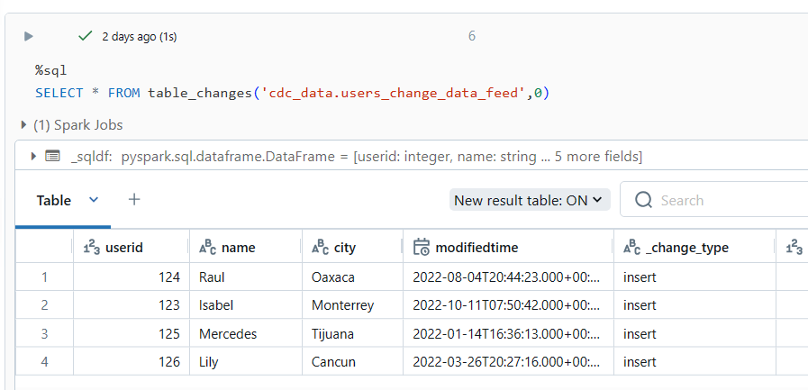
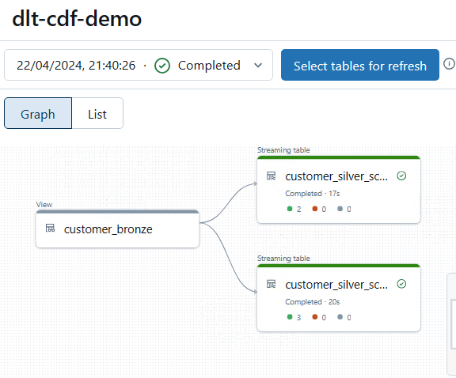

# Working with Change Data Feed and Delta Live Tables in Azure Databricks

## Introduction

This document provides an overview of how to work with Change Data Feed and Delta Live Tables in Azure Databricks. We have use case where we have a pre-populated delta table. The delta table gets updated from the external agent. We will use Change Data Feed to capture the changes in the delta table and then use Delta Live Tables to apply these changes to target delta table.

**Source Delta Table --> Change Data Feed in ADLS Gen2--> Delta Live Table --> Target Delta Table**

## Prerequisites

- Azure Databricks account
- Basic knowledge of Delta Live Tables and Change Data Feed

## Setup

Here are the four step process to this use case:
1. Enable the change data feed to establish a delta table.
2. Construct a control table that retains the watermark timestamp for subsequent extraction of the change data feed. 
3. Retrieve the change data feed from the delta table and export it as a CSV file from previous watermark timestamp till current timestamp.
4. Use Delta Live Table framework to create the target delta live table to incorporate the changes from source delta table.


## Step 1: Enable Change Data Feed in the users table

```sql
CREATE SCHEMA IF NOT EXISTS cdc_data;
create table if not exists cdc_data.users_change_data_feed
(
  userid int,
  name string, 
  city string, 
  modifiedtime timestamp
)
TBLPROPERTIES (delta.enableChangeDataFeed = true)
```
```sql
INSERT INTO cdc_data.users_change_data_feed
VALUES
  -- Initial load.
  (124, 'Raul', 'Oaxaca', '2022-08-04 20:44:23'),
  (123, 'Isabel', 'Monterrey', '2022-10-11 07:50:42'),
  -- New users.
  (125, 'Mercedes', 'Tijuana', '2022-01-14 16:36:13'),
  (126, 'Lily', 'Cancun', '2022-03-26 20:27:16')
```

Reading the change data feed from the delta table
```sql
%sql
SELECT * FROM table_changes('cdc_data.users_change_data_feed',0)
```


## Step 2: Construct a control table 

The control table will retain the watermark timestamp for subsequent extraction of the change data feed. The control table will have the following columns:
- delta_table_name: The name of the delta table for which the change data feed is enabled.
- processed_end_timestamp: The watermark timestamp that will be used to extract the change data feed.
- change_data_feed_file_name: The name of the CSV file that will be generated for the change data feed. We will add a numeric value at the end of the filename for Lexical ordering (https://learn.microsoft.com/en-us/azure/databricks/ingestion/auto-loader/directory-listing-mode#--lexical-ordering-of-files)
- current_timestamp: The timestamp when the record was inserted into the control table.
    
```sql
-- Create schema and control table for CDC data tracking
CREATE SCHEMA IF NOT EXISTS cdc_data;

--DROP TABLE IF EXISTS cdc_data.control_table;

CREATE TABLE IF NOT EXISTS cdc_data.control_table (
    delta_table_name STRING,   
    processed_end_timestamp TIMESTAMP,
    change_data_feed_file_name STRING,
    current_timestamp TIMESTAMP DEFAULT CURRENT_TIMESTAMP
)
USING DELTA 
TBLPROPERTIES ('delta.feature.allowColumnDefaults' = 'supported');

 ```
```sql
-- Insert a record into the control table for the delta table related to user changes.
INSERT INTO cdc_data.control_table (
    delta_table_name,   
    processed_end_timestamp,
    change_data_feed_file_name,
    current_timestamp
)
VALUES (
    'cdc_data.users_change_data_feed',
    '2000-01-01T00:00:00', -- inserting old value as we are initiating the control table.
    'cdf_cdc_data.users_change_data_feed_000000000.csv',
     CURRENT_TIMESTAMP() 
);
```

## Step 3: Retrieve the change data feed from the delta table and export it as a CSV file

First, get the latest watermark timestamp from the control table. and construct the file name with incrementing the number at the end of the file name.

```python
query = f"SELECT processed_end_timestamp, change_data_feed_file_name FROM cdc_data.control_table where delta_table_name = '{delta_table_name}'"
df = spark.sql(query)
processed_end_timestamp = df.collect()[0]["processed_end_timestamp"]
change_data_feed_file_name = df.collect()[0]["change_data_feed_file_name"]

change_data_feed_file_name_prefix_words = change_data_feed_file_name.split(".")[0].split("_")
change_data_feed_file_name_prefix_words.pop()
change_data_feed_file_name_prefix='_'.join(change_data_feed_file_name_prefix_words)

change_data_feed_file_number = str(int(change_data_feed_file_name.split("_")[-1].split(".")[0])+1).zfill(9)
new_file_name = change_data_feed_file_name_prefix+"_"+change_data_feed_file_number+".csv"
```

Here is the query which gives the changes that happened in the delta table

```sql
SELECT userid, name, city, modifiedtime, 
CASE _change_type
    WHEN 'update_postimage' THEN 'update'
    ELSE _change_type
END AS operation
FROM 
    (SELECT *
    FROM table_changes('cdc_data.users_change_data_feed', '{processed_end_timestamp}')
    WHERE _change_type != 'update_preimage')
order by modifiedtime desc
```

Save change feed into a storage account. Spark generally writes the data into a folder. Here we have used the temp folder, so that we get a single file from the command. 

```python
import datetime
current_timestamp = datetime.datetime.now().strftime("%Y-%m-%d_%H-%M-%S")
# the below code content to create single csv file 
csv_temp_location = f"abfss://misc@adlsg2contosoodbk.dfs.core.windows.net/temp/change_data_feed1/cdf_{delta_table_name}_{current_timestamp}.csv"
file_location = f"abfss://misc@adlsg2contosoodbk.dfs.core.windows.net/change_data_feed1/cdf_{delta_table_name}_{current_timestamp}.csv"

df.repartition(1).write.csv(path=csv_temp_location, mode="append", header="true")

file = dbutils.fs.ls(csv_temp_location)[-1].path
dbutils.fs.cp(file, file_location)
dbutils.fs.rm(csv_temp_location, recurse=True)
```
update the control table with the latest timestamp

```python
current_timestamp = datetime.datetime.now()
sqlquery = f'''
update cdc_data.control_table 
set processed_end_timestamp='{current_timestamp}', change_data_feed_file_name='{new_file_name}', current_timestamp='{current_timestamp}'
where delta_table_name = '{delta_table_name}'
'''
spark.sql(sqlquery)
```

Step 4: Use Delta Live Table framework to create the target delta live table

Here is the delta live table code to apply the changes to the target delta table (customer_silver_scd_type_1, customer_silver_scd_type_2). The code will apply the changes to the target delta table based on the SCD type 1 and SCD type 2. 

```python
# load the data from the external adls g2 location
@dlt.view
def customer_bronze():
  df = spark.readStream.format("cloudFiles") \
      .option("cloudFiles.format", "csv") \
      .load(folder_path)
  return df

# testing the scd type1 table.
dlt.create_streaming_live_table(
  name = "customer_silver_scd_type_1",
  comment = " this is the silver data - SCD type 1",
  path = "/mnt/external_datalake/cdcdata/tables/customer_silver_scd_type_1",
    table_properties={
    "quality": "silver"
  }
)
  
dlt.apply_changes(
  target = "customer_silver_scd_type_1",
  source = "customer_bronze",
  keys = ["userid"],
  sequence_by = col("modifiedtime"),
  apply_as_deletes = expr("operation = 'DELETE'"),
  except_column_list = ["operation"],
  stored_as_scd_type = "1"
)

# testing the scd type2 table.

dlt.create_streaming_live_table(
  name = "customer_silver_scd_type_2",
  comment = " this is the silver data - SCD type 2",
  path = "/mnt/external_datalake/cdcdata/tables/customer_silver_scd_type_2",
    table_properties={
    "quality": "silver"
  }
)

dlt.apply_changes(
  target = "customer_silver_scd_type_2",
  source = "customer_bronze",
  keys = ["userid"],
  sequence_by = col("modifiedtime"),
  apply_as_deletes = expr("operation = 'DELETE'"),
  except_column_list = ["operation"],
  stored_as_scd_type = "2"
)
```


